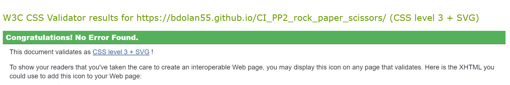
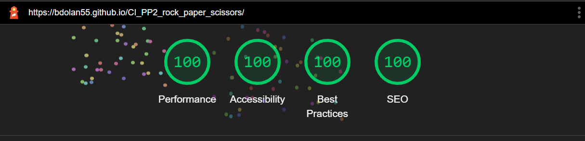

# Rock Paper Scissors Game
(Developer: Brian Dolan)

# Rock Paper Scissors Game
The Rock Paper Scissors Game is a simple and fun game. It has been created using HTML, CSS and JavaScript. The game allows users to choose between rock, paper, or scissors and then compares their choice to the computer's randomly generated choice. The outcome of the game is determined by the rules of the classic game and displayed on the screen. The game also keeps track of the score and Is a first player to 5 match but also has the facility that allows the players to play again and also reset game mid match. The user interface is designed with HTML and CSS, making it easy to understand and navigate. The game logic and functionality is implemented using JavaScript, making the game interactive and dynamic. Overall, the Rock Paper Scissors Game is a great way to pass the time and can be enjoyed by players of all ages.

[Live webpage](https://bdolan55.github.io/CI_PP2_rock_paper_scissors/)

## Table of Content

1. [Project Goals](#project-goals)
    1. [User Goals](#user-goals)
    2. [Site Owner Goals](#site-owner-goals)
2. [User Experience](#user-experience)
    1. [Target Audience](#target-audience)
    2. [User Requrements and Expectations](#user-requrements-and-expectations)
    3. [User Stories](#user-stories)
3. [Design](#design)
    1. [Design Choices](#design-choices)
    2. [Colour](#colour)
    3. [Fonts](#fonts)
    4. [Structure](#structure)
    5. [Wireframes](#wireframes)
4. [Technologies Used](#technologies-used)
    1. [Languages](#languages)
    2. [Frameworks & Tools](#frameworks-&-tools)
5. [Features](#features)
6. [Testing](#validation)
    1. [HTML Validation](#HTML-validation)
    2. [CSS Validation](#CSS-validation)
    3. [Accessibility](#accessibility)
    4. [Performance](#performance)
    5. [Performing tests on various devices](#performing-tests-on-various-devices)
    6. [Browser compatibility](#browser-compatability)
    7. [Testing User Goals](#testing-user-goals)
8. [Bugs](#Bugs)
9. [Deployment](#deployment)
10. [Credits](#credits)
11. [Acknowledgement](#acknowledgement)

## Project Goals 

### User Goals
- Learn how to play Rock Paper Scissors.
- Gain an understanding of the Rules in this Rock Paper Scissors game.
- The ability to choose the gesture and compete against the computer.
- See the current score inmt he match.
- Reset the game and start again at any point if I want to.

### Site Owner Goals
- Provide the visiting user a good understanding of the game and rules.
- Allow to site ability to make there choice fromn the availabe hands.
- The site visitor playing ther game shoule be able to see the current score in the match easily.
- Provide the option to play the again if they win or lose.
- Provide a user friendly enviornment to encourage the visitor to return to play again.

## User Experience

### Target Audience
- This game would be aimed at casual gamers who emjoy a quick and easy game to pass the time.
- The game is a great way to pass the time, whether waiting in line, on a break, or just looking for something to do.

### User Requrements and Expectations

- The ability to make a selection of rock, paper, or scissors and have it register with the game.
- The site visitor should be able to see the outcome of the game and understand who has won or lost.
- Easily keep track of the score and see how many rounds they have won or lost.
- Ability to redtart the Game easily to 0-0 if required.

### User Stories

#### First-time User 
1. As a first time user, I want to find understand the rules to the Game.
2. As a first time user, I want to add my name into game to make it a more personal experience.
3. As a first time user, I want to be able to see the current score in the match.
4. As a first time user, I want to be notified when I win, lose or draw a hand and a game.
5. As a first time user, I want to have the ability to reset game if I want.

#### Returning User
5. As a returning user, I want a reminder on the game rules.
6. As a returning user, I want to enjoy the game like the first time I visited ther site.
 

#### Site Owner 
7.  As the site owner, Provide clear details on how to play the game.
8. As the site owner, Provide the ability to insert your name into the game to make it more interactive the player.
9. As the site owner, Provide a user frindly interface and enjoyable experience.
10. As the site owner, Provide the ability to see the score in the current match.
11. As the site owner, Provide clear indication on who wins , losses or draw the hand.
12. As the site owner, Provide clear indication on who wins , losses or draw the match.
13. As the site owner, Provide the player the ability to reset the scores on the current game and start again at 0-0.
---

## Design

### Design Choices
The Rock Paper Scissors game was designed to be clean, user friendly and an enjoyable experienece. Notifications have been added with animations to provide the user a fun game experience and also show the user visually if they have won, lost or drawn. 

### Colour
The colors scheme chosen for Rock paper Scissors game is to provide an enjoyable easy on the eye experience. The blue palette that has been chosen because it is know to provide feelings of confidence, trust and tranquility to the visitors to coming to the site to play the game. I used the Coolors palette website to find the colors used with the website.
 

### Fonts
The Font chosen for the Rock Paper Scissors game is from the Google Fonts Barlow Family. The font chosen is the Barlow 700 for Headings and Barlow 200 for text throughout the site.. This was chosen to promote a clean, functional and fun look to the game.
 

### Structure
The website has been presented in a User friendly and easily navigated way. On visting of the site you will be met with a pop up to tell you the rules and ways to win and also a text box for you to enter your name so the player score will be personal to the game player. When you enter the game section of the site, there is a score board to show who is winning the match between you and the computer. The 3 main icons on the page are Emoji hanmd shaped as rock, hand shaped as paper and lastly hand shaped like sciisors. The user chosses from these 3 option there choice of hand they want to use for each round. When the mouse pinter goes over the hands they will hover for effect. When the hand is chosen it will glow red for loser, green for winner and orange if it is a draw and also the text above the emoji hands will change to show result and go the same color as the result. The game is based on a first to five methoid. When either the Player or the Computer get to five wins a pop up will show the winner of the game and reset the scores to 0-0. There is also a reset game button below the emoji to allow the ability to reset the score to 0-0 at any time.

### Wireframes

Wireframe Desktop Layout

Wireframe Mobile Layout

Wireframe Tablet Layout

---

## Technologies Used

### Languages
- HTML - Used for the Basic Layout of the Rock paper and Scissors Game.
- CSS - Used for the styling of the Rock Paper and Scissors Game.
- JavaScript - Used for Game functionality and interactivness of the page.

### Frameworks & Tools
- <a href="https://github.com/">Github</a> - Storing the pushed code and Version Control of the website.
- <a href="https://www.gitpod.io/">Gitpod</a> - Online IDE.
- <a href="https://balsamiq.com/">Balsamiq</a> - Wireframe Software used at start of Project for site layout.
- <a href="https://fonts.google.com/knowledge">Google Fonts</a> - Used for the fonts within the website. Link within Head of the website
- <a href="https://fontawesome.com/">Font Awesome</a> - Used for the emojis acting as the Rock, Paper and Scissor hands.
- <a href="https://favicon.io/">Favicon</a> - Used for the Browser tab Logo. Link within head of Website.
- <a href="https://coolors.co/">Coolors</a> - Color palettes used on website.

## Features
The website consists of a main home page hosting the Rock Paper Scissors game and a Popup screen explaining the rules of the game and textbox for entering the players name.

### PopUp Box
- The Popup box appears on first load of the page on top of the game area.
- The Popup box coloring is the same as the game container to encourage continuity throughout the page.
- The Popup box has a enter name textbox at the bottom to allow for the site visitor to enter there name so the value of this textbox will be entered in the game area at the player score section.
- The Popup box has a enter name textbox at the bottom and has an focus event set. This allows the user the ability to type straight into the textbox area without having to click into the textbox. 
- The "Lets Fight" button located at the bottom of the page is linked with a function as to when the user enters there name and clicks it the Popup box will dissappear and the event listener click on the button runs the game function for the user to play.
- The Popup box is responsive to different screen sizes to assist with playing on different devices.
- User Stories Covered: 1, 2, 5, 7, 8 and 9

### Scoring Area
- The scoring area player name is entered from the Popup box on first page load. This box allows the scoring section to display the "players name" Score.
- The scoring area displays the current score of each hand from both the Player and the Computer. The scores increment after every hand to show the current game score on the race to first to 5 wins.
- The Scoring Area is responsive to different screen sizes to assist with playing on different devices.
- User Stories Covered: 3, 10 and 11

### Game Area
- The game areas Rock Paper and Scissors Hand Emojis have a hover effect when the mouse is over it to show which hand you may select.
- Above the Rock Paper Sciccors Hand Emojis there is text to show you the result of the hand just played. The text color changes with the result of the round. Green for Win, Red for loss and Orange for Draw.
- The game areas Rock Paper and Scissors Hand Emojis have an result color glow when clicked to show the round result. Green for Win, Red for loss and Orange for Draw.
- The Game Area is responsive to different screen sizes to assist with playing on different devices.
- User Stories Covered: 4, 9 and 11

### Game Reset
- The "Reset Game" button has a hover effect to change color to red for when the player puts the pointer on it. This red color indicates as a warning that if pressed the current game will end and the scores will return to 0-0.
- When the player presses the "Reset Game" button this will trigger a function to reset the game scores to 0-0 and start again.
- The Game Reset button is responsive to different screen sizes to assist with playing on different devices.
- User Stories Covered: 5, 9 and 13.

### Game Over PopUp
- When a game is complete and either the Player or the computer reaches 5 first a PopUp box alert come on the screen to notify the player of the result.
- When the OK button is clicked on the PopUp alert box it resets the game to 0-0 and allows the player to play the game again.
- User Stories Covered: 4 , 9  and 12.

---

## Validation
 

### HTML Validation

The Rock Paper Scissors game website was tested using W3C Markup Validation to validate the HTML code from the website. The page has passed with no errors or no warnings.

Home Page

 

### CSS Validation
The Rock Paper Scissors Game website was tested using W3C Jigsaw CSS Validator to validate the CSS code within the website. The Rock Paper Scissors Game CSS passed the W3C Jigsaw CSS Validator and showed no errors recorded.

Home Page

 

### Accessibility
The Rock Paper Scissors Game website was tested using WAVE WebAIM accessibility tool to ensure the website shows no accessibility errors. The Rock Paper Scissors Game website have passed accesibility testing with no errors recoreded.

Home

 

### Performance 
The Rock Paper Scissors Game website was tested for performance using Google Lighthouse within Google Chrome Developer Tools. The Rock Paper Scissors Game website has passed with 100% in all 4 areas.

Home

Mobile Version

 

### JSHint
The Rock Paper Scissors Game website was tested for JavaScript errors using JSHint.The Rock Paper Scissors Game website have passed JSHint testing with no errors recoreded. The settings have been set to JavaScript ES6.

JavaScript Testing

 

### Performing tests on various devices 
The website was tested on the following devices:
- Redmi Note 11 Pro 5G
- Lenovo Ideapad Flex 5
- The responsivness of the site was also texted with the google developer tools to show the website responsivness to various screen sizes.

### Browser compatability
The website was tested on the following browsers:
- Google Chrome
- Mozilla Firefox
- Microsoft Egde

---

### Testing User Goals 

#### First-time User 
1. As a first time user, I want to find understand the rules to the Game.
    * On initial loading of the page, The user will be met with a pop up box over the game container. The pop up box show the rules to the game Rock paper Scissors and also show what hand beats what hand so the user will gain the understanding on how to win or lose.
2. As a first time user, I want to add my name into game to make it a more personal experience.
    * On initial loading of the page, The user will be met with a pop up box over the game container. This popup box has the rules of the game but also at the bottim it has a text box prompting the user to insert there name and press the fight button. The value entered in the text box will be shown within the game container and the name/value will be set beside the players score.
3. As a first time user, I want to be able to see the current score in the match.
    * Within the game container above the Rock paper Scissors hand gesture emojis there is a scoreboard. The score board shows the player score and the computer score side by side. The game is first to 5 wins.
4. As a first time user, I want to be notified when I win, lose or draw a hand and a game.
    * When the user is playing the game and deciding on what gesture to pick wether its Rock paper or scissors, The user will see the gestures hover when they put the mouse pointer over it. When the player decides and clicks the chosen hand the hand will glow a color of green for win, Red for lose or Orange for draw. Text above the emjois will also tell player the result of the round and will be coloured the same as the hand gesture with the result. The game is first to 5 so when either the player or computer gets to 5 the user will be met witrh an alert box stating if they have won, lost or drawn and will reset the game to 0-0 when the user presses ok. 
5. As a first time user, I want to have the ability to reset game if I want. 
    * Below the hand gestures there is a button that says "reset". This button will return the game to 0-0 when clicked. There is a hover effect on the button and it changes red like a warning to indicate to the player that the game will be over if pressed.
 

#### Returning User
5. As a returning user, I want a reminder on the game rules.
    * Similar to the first time the user has visited, The user will be met with a popupbox displaying the rules and what hand gesture win against other hand gestures. 
6. As a returning user, I want to enjoy the game like the first time I visited ther site.
    * Rock paper scissors is fun and easy game to play. The website encourages playing with its  
     User frindly experince and is for people of all ability and ages.The user will be able to navigate the game easily and understand the interface and allow the player to enjoy the game.

#### Site Owner 
7.  As the site owner, Provide clear details on how to play the game.
    * On initial loading of the page, The creator / owner has set a pop up box over the game container. The pop up box show the rules to the game Rock paper Scissors and also shows what hand beats what hand so the user will gain the understanding on how to win or lose.
8. As the site owner, Provide the ability to insert your name into the game to make it more interactive the player.
    * On initial loading of the page, The creator / owner has set a pop up box over the game container. This popup box has the rules of the game but also at the bottom it has a text box prompting the user to insert there name and press the fight button. The value entered in the text box will be shown within the game container and the name/value will be set beside the players score.
9. As the site owner, Provide a user frindly interface and enjoyable experience.
    * The game is visually striking with the color pallette chosen to highlight and bring forward all buttons and Hand gesture so that the visitor will enjkoy the experience with the game. The website encourages playing with its User friendly experience and is set up for people of all abilities and ages to have fun.
10. As the site owner, Provide the ability to see the score in the current match.
    * Within the game container above the Rock paper Scissors hand gesture emojis there is a scoreboard. The score board shows the player score and the computer score side by side. The game is first to 5 wins.
11. As the site owner, Provide clear indication on who wins , losses or draw the hand.
    * When the player decides and clicks the chosen hand, the hand will glow a color of green for win, Red for lose or Orange for draw. Text above the emjois will also tell player the result of the round and will be coloured the same as the hand gesture with the result.  
12. As the site owner, Provide clear indication on who wins , losses or draw the match.
    * The game is first to 5 so when either the player or computer gets to 5 the user will be met with an alert box stating if they have won, lost or drawn and will reset the game to 0-0 when the user presses ok.
13. As the site owner, Provide the player the ability to reset the scores on the current game and   
    start again at 0-0.
    * There is reset button located at the bottom of the game container area. When pressed this will end the current game and reset the score to 0-0.
---

## Bugs and Future Works

- I had an issue with page responsivness with the PopUp box at page load. When the page dropped below the 1200px the Popup would start disappearing off the page at the top and would only show half of the content. The PopUp box is set to position:absolute and z-index:2 to appear above the game container. What i found is if i changed the margin top on the PopUp container it would push the game down to a viewable level. This was done from  1200px down to all screen sizes in the media section to allow a nice and functionable feayure.

- I had an issue with the Reset button positioniong on the page. This was showing up even when the pop up was visible and also clickable. This could confuse users and also as per PP2 criteria I can not have something distarcting in the background that can take away from normal usage. I created a function within the javaScript that when the popUp appears on page load. The Reset button would be set to Display:none in the CSS and would not be viewable to the user. Now when the user presses the "Lets Fight" button on the pop up page. This then triggers ther function and sets the button to Display: Block and fully usable as inteded.

- I had an error messages in the Console in the developer tools using the Chrome Browser. The error read "Uncaught (in promise) Error: A listener indicated an asynchronous response by returning true, but the message channel closed before a response was recieved". This error would not come up in the consoloe straight away when loaded. It could take 5 minutes to pop up and sometimes it did not appear up at all. After some investigation I found online <a href="https://stackoverflow.com/questions/72494154/a-listener-indicated-an-asynchronous-response-by-returning-true-but-the-messag">Stack Overflow</a> that this error is caused by Google Chrome - "This is caused by Chrome Extensions making cross-origin requests. The Chrome Extensions should return true when fetching from cross-origins." I found if I opened the site in Microsoft Edge or Google Chrome Incognito mode the error did now not display. 

- I had an bug on the function to end the match when either the player or the compuiter reaches 5 wins. I had function set to when player or computer === 5 run alert message and reset game. I changed the the result to >= 5 and this allowed the game to run to 6 rounds which still was incoreect. After some time I started researching on <a href="https://developer.mozilla.org/en-US/docs/Web/JavaScript/Reference/Operators">MDN Web docs</a> for a solution. I found that the "===" operator I was using was incorrect and should be "==". When the function was altered all worked as expected.

- When completing the Chrome developer Lighthouse testing. I was recieveing a low score in the SEO section. After reading the results causes in the Lighthouse Testing report it stated to include more details within the head of the HTML page giving description of what the page was for. I used <a href="https://www.w3schools.com/tags/tag_meta.asp">W3 Schools</a> Meta Tag information on how to improve this which in turn brought my score on the SEO up to acceptable level.

- In a future update I would like the pop up "Game Over" alert to be customised to a Popup to suit the site allow for continuity througout.

- In a future update I would like to add sounds effects to the Rock Paper and Scissors button presses so that each hand has a sound effect of a punch like in a fighter type game. Also when the game is over and either the player or Computer wins the sound effect would play with the noise of a cheering crowd.

---

## Deployment
The website was deployed using GitHub Pages by following these steps:
1. In the GitHub repository navigate to the Settings tab
2. Within the settings tab click on the pages section on the left hand side on page.
3. Navigate to the Build and deployment area of the page and select deploy from a branch.
4. Within the branch section choose the which root file you would like to deploy.
5. hit the tab to the right and the dropdown menu choose the file location.
6. Press save and the site will deloy and be visible at the top of the page.

How fork a repository by following the below steps:
1. Go to the GitHub repository
2. Click the fork icon on the top right of the page.
3. Hit the tab with the owner of the forked repository.
4. As default the repository will be named the same as original Repo but can be changed in box besode ownser tab.
5. You can add description for repository to the fork file in the text area below the fork repository tabs.
6. Below the description box you can choose to fork the default branch or all branches for the repository.
7. Click create fork.

You can clone the repository by following these steps:
1. Go to the GitHub repository 
2. Within the file dropdown menu click the clone repository button.
3. Click the repository tab you would like to clone.
4. Choose the repository you would like to clone in dropdown menu.
5. Click and highlight repository you would like to clone.
6. Click clone button below menu.
---

## Credits

  
### Code used and adapted

In order of appearance:
- <a href="https://www.youtube.com/watch?v=jaVNP3nIAv0">Free Code Camp</a> was used to understand Rock Paper Scissors Javascript formation and how to structure the code and functions to achioeve the end result. Inspiration was also taken in sections of the page for design of my Rock Paper Scissors game.
- <a href="https://developer.mozilla.org/en-US/docs/Web/JavaScript/Guide/Introduction">MDN Web Docs</a> to assist in correct formation of functions and event listeners.
- <a href="https://www.w3schools.com">W3 Schools</a> was used to assist me in small programming methods I had throughout the entire Project. 
- <a href="https://www.youtube.com/watch?v=sEJB7FtBoug&t=2s">Coding Artist</a> video was used to assist on the ability to Get a PopUp page to appear automatically on loading of the page. 
- <a href="https://www.youtube.com/watch?v=aEj0Wu33hJM">Six Minutes Smarter</a> video was used to assist on the ability to take the value from my textbox on the PopUp to display within the game area container. This was to allow the user to insert there name within the game and it to be displayed beside there score in the scoring area. 
- <a href="https://www.w3schools.com/tags/tag_meta.asp">W3 Schools</a> Meta Tag information on how to improve the web page SEO.
- <a href="https://learn.codeinstitute.net/ci_program/diplomainsoftwaredevelopmentecomm">Code Institute</a> Software development course was used to assist me in small programming methods I had throughout the entire Project through the well taught and informative Tutorials. I also used the Love Maths tutorials to learn how to use the DOMCONTENTLOADED function and the focus Function to allow the text box on the PopUp to be automatically ready to enetr the Player Name Text.
- <a href="https://github.com/4n4ru/CI_MS1_BodelschwingherHof"> Ana ( github = 4n4ru )</a> to assist with structure and expectation required for a Github README section. 

## Acknowledgment

* I would like to Thank my partner Sarah and 2 little boys for allowing me the opportunity and time to study and work on this project even when times were tough and hectic.
* I would like to Thank Mo Shami for his patience, encourangement and guidance throughout this project.
* I would like to thank the people within the Slack community. The Slack community has been a wealth of knowledge and help throughout this project from new users like me and all alumni, CI staff and beyond. This community is a credit to Code Institution and encourages the work ethic but also willingness to help. 
* I would lastly like to Thank the team at Code Institute for the opportunity to be involved in this course and also the staff that have been nothing but encouraging, friendly and helpful through this process.